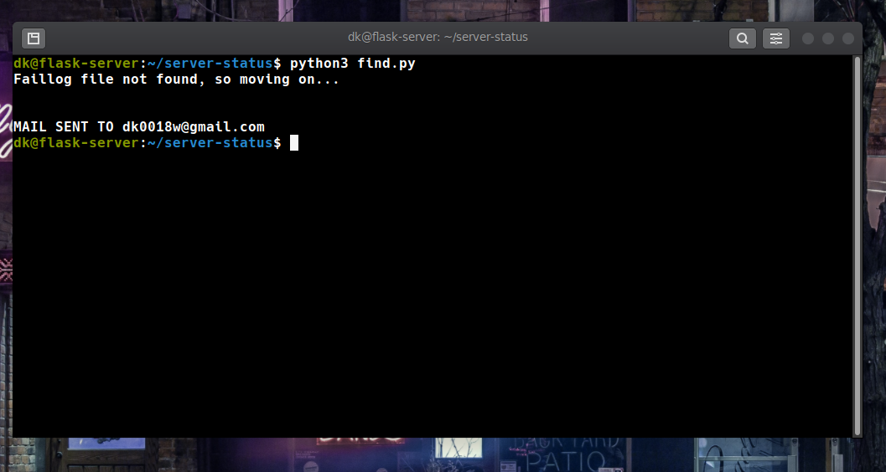

# Networking

## Question - 1
I made a python script for this question which can be found [here](https://github.com/divyashk/server-status)

I divided the question into 3 parts -
* Finding the location of files that store such details about a server, and also finding all the commands that reveal such information.
* Extracting important details from these files/commands in a format that is easily readable by an administrator and then summarize them.
* Transferring this summary through mail to the administrator on a daily basis.

> note- I'll be implementing this script on my Linux server( Ubuntu 20.04 ) and all the findings will be in context with this sever(debian based servers in general).

1. ### Finding the location of files that store such details about a server, and also finding all the commands that reveal such information - 
   
    * first command that I found to check the status of services that are stored in "/lib/systemd/system" directory was 
        ```bash
            $service <your service name> status
        ```
        I could easily store its output in a file as such
        ```bash
            $service <your service name> status > store_file
        ```
        Now, this command I ran in a python script using the os module's **os.system("my command")**.
        So these findings resulted in a simple python code -
        ```python
        import os
        os.system('service app status > services-status')

        # You can replace the "app" with a particular service that you want to monitor
        # In my case it was a service named 'app' that I created to run Gunicorn for my blog site.
        # You can also monitor multiple services by adding another such line.
        #  os.system('service another_service status >> services-status')
        ```
    * Next, I discovered the **/var/log** directory that stored all the important logs that are generated by different applications and processes. In this directory I discovered 4 important logs, which were 
      * nginx/access.log
      * syslog
      * faillog
      * autlog
    
    Now I needed to extract important details from these logs.

2. ### Extracting important details from these files/commands in a format that is easily readable by an administrator and then summarize them.
    * For reading  data from these file I decided to use Regular Expression module in python. For this I first had to learn  "group capturing and naming" in regex and it's implementation in python.
    * Then I used certain sample logs from my system to create a pattern for each log online (using the site www.regexr.com).
    * After generating a pattern for each file I wanted to setup **filters** for certain keyword like **"error, denied, ssh, failed, fatal"**. These keywords can of course be updated and modified to suite my requirement.
    * I also made a filter that only considers logs from a specific day( In our case the same day).
    * finally I wrote my findings into a file.
  
  The completed code for a single log-file looked something like this-
  ```python
    #remember the indentation is subject to your screen width and therefore not reliable
    #reading from /var/log/auth.log
        if os.path.exists('/var/log/auth.log'):
            with open('/var/log/auth.log', 'r', encoding='utf-8') as read_file:
                lines = read_file.readlines()
                with open('authlog-report', 'w') as f_write:
                    f_write.write("Important AUTHLOGS till {}\n\n".format(datetime_now.strftime("%c")))
                   
                    f_write.write('{0:2}\t{1:4}\t{2:10}\t{3:15}\t{4:25}\t{5:50}\n\n'.format("Day","Month","Time","Logger","Application","Message"))
                    for line in lines:
                        pattern_dist = re.compile(r'(?P<month>[A-Z][a-zA-Z][a-zA-Z])\s(?P<day>\d\d)\s(?P<time>\d\d:\d\d:\d\d)\s(?P<logger>[^\s]*\s)(?P<application>[^\s]*\s)(?P<message>.*)')
                        pattern_filter  = re.compile(r'(ssh|22|pam\|unix|failed|error|denied|could\'nt|fatal)',re.IGNORECASE)
                        if pattern_filter.search(line)!= None:
                        obj_grps = pattern_dist.search(line);
                        if obj_grps.group('day') == day and obj_grps.group('month') == month:
                            
                            f_write.write('{0:2}\t{1:4}\t{2:10}\t{3:15}\t{4:25}\t{5:50}\n\n'.format(obj_grps.group("day"),obj_grps.group("month"),obj_grps.group("time"),obj_grps.group("logger"),obj_grps.group("application"),obj_grps.group("message")))
            f_write.close()
```
### 3. Transferring this summary through mail to the administrator on a daily basis.

  * For this I used python's **smtp** module. I had used this module before to send password_reset email before. But this time I also needed to attach files into the mail.
  * I used the **email** module in python along with MIME to configure my email with files.
    The code looked something like this-
    ```python
    #saves the file location
    filename='services-status'
    # opens the file   
    attachment  =open(filename,'rb')
    # creates a part that will later be attached       
    part = MIMEBase('application','octet-stream')  
    # stores the file in the payload of the part 
    part.set_payload((attachment).read())
    # encodes the part with base64
    encoders.encode_base64(part)
    # adds header to the part with the filename
    part.add_header('Content-Disposition',"attachment; filename= "+filename)
    # finally attaches the part to the msg of the mail.
    msg.attach(part)
    ```
    The complete code for sending the mail can be seen in the [script](https://github.com/divyashk/server-status).

* ### The script is complete and we only need to automate it.
    For this I decided to go with a cron job instead of apscheduler module because the idea of a simple script running all the time seems a bit forced. Also I won't have to restart my script if my server shutsdown/restarts.
    The cron tab can be set like this-
    ```bash
    0 23 * * * /usr/bin/python3 /home/dk/server-status/find.py    #sends the mail every night at 11 pm
 
    ```


> Important- For the script to execute and create report files, we need to change the permission of the directory of the find.py. This can be done using the **chmod** command.

## Testing the script on my own linux server
  * First I ssh into my server and clone the repo server-status.
  * Then I ran the find.py file using python3 and got this output .
  * Now the mail has been sent and you will receive something like this.
  * The sample reports can be found in the images directory.


## Question - 2

I initially wanted to use the command.

```bash
$whois students.iitmandi.ac.in
```

but as it turns out, 'students.iitmandi.ac.in' is a **subdomain** and therefore whois might not work.

Therefore I tried the same command with 'iitmandi.ac.in' and it worked.

```bash
$whois iitmandi.ac.in
```

The output was-

```Domain Name: iitmandi.ac.in
Registry Domain ID: D4020030-IN
Registrar WHOIS Server:
Registrar URL: http://www.ernet.in
Updated Date: 2020-03-18T10:09:09Z
Creation Date: 2010-02-02T10:09:08Z
Registry Expiry Date: 2021-02-02T10:09:08Z
Registrar: ERNET India
Registrar IANA ID: 800068
```

It listed [ERNET India](http://www.ernet.in) as the registrar.

ERNET India has been appointed as an exclusive domain registrar for the education and research domains registering the domains under the .in registry from 2005. It registers Domains at second and third level for ac.in, edu.in and res.in zones.

One can also visit the site [whois.domaintools](https://whois.domaintools.com) and enter the sub-domain [students.iitmandi.ac.in] itself and will get the same result.

## Question - 3
I used the command nmap with flag '-p' to scan all the ports from 1-2000

```bash
$nmap -p 1-2000 iitmandi.co.in | grep open
```

It returned the following as open.
```
21/tcp   open     ftp
22/tcp   open     ssh
53/tcp   open     domain
80/tcp   open     http
443/tcp  open     https
554/tcp  open     rtsp
1723/tcp open     pptp

```
>note- Only 4 of them were left open when I last checked.

## What did I Learn?
* REGULAR EXPRESSION (the best part)
* Attaching files in an automated email.
* Learning the format of linux logs.
* Running bash command in python using the os module.
* implementation of regex in python

