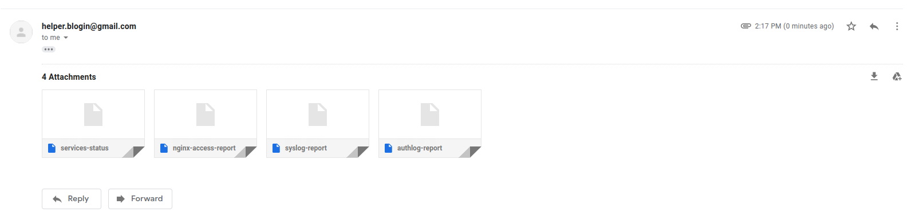

# Submission for the Kamandprompt/SysADMIN 2020 problemset 

# Administration

## **Question-1**  Setting up your own VPN (Virtual Private Network)

I used Google's Compute Engine as my IaaS provider because I am quite familiar with how it authenticates and implements Service accounts(required for the builder, which is going to be my desktop).

I built the vpn-server as follows.

   * First I installed all the dependencies from the Streisand docs. Then I cloned the repository onto my desktop( didn't really go for a remote server as a builder, since I have Linux installed).
   ```
      5  sudo apt update && sudo apt install git python-pip -y

      6  git clone https://github.com/StreisandEffect/streisand.git && cd streisand

      7  ./util/venv-dependencies.sh ./venv

      8  sudo apt-get install python3-pip python3-openssl python3-dev python3-setuptools python3-venv python-cffi libffi-dev libssl-dev libcurl4-openssl-dev

      9  ./util/venv-dependencies.sh ./venv

      10  source ./venv/bin/activate
   ```
   * Once in the python virtual environment having all the dependencies installed, I ran the streisand file from the cloned repository.
   ```
      ./streisand
   ```

   * Now I was asked to create a service account on the google platform and provide a service.json file. I created the service key on the platform (in the API and Services section) and downloaded the corresponding .json file.
  
   * Then I was prompted to enter a 'fully qualified domain' for the vpn-server, for which I used the subdomain - vpn.divyasheel.com , before doing this I set the A-record for this sub-domain on the google platform and linked it to the newly created vpn-server.
  
**After entering the domain I experienced some issues.
The series of fatal errors that I got were something like this->**
1. ```
   TASK [gpg : Refresh the Streisand GPG keyring with keyserver information] ******
   fatal: [128.199.142.41]: FAILED! =>........something bla bla
   PLAY RECAP *********************************************************************
   128.199.142.41             : ok=31   changed=22   unreachable=0    failed=1    skipped=13   rescued=0    ignored=0   
   localhost                  : ok=13   changed=4    unreachable=0    failed=0    skipped=0    rescued=0    ignored=0   

   ```
   * I went onto to the github repository of 'streisand' to look for fixes and found that the author suggested changing (just a workaround,not a fix) the line 89(in my local repos, it was 88) to 
      ```when: False.``` So I made these changes and it worked!

   * I had to start the process all over again,which involved deleting the previously built server and the corresponding A-record.
   

2. ```
   Error when installing OpenVPN by Streisand:
   failed: [localhost] (item=None) => {"censored": "the output has been hidden due to the fact that 'no_log: true' was specified for this result", "changed": false}
   fatal: [localhost]: FAILED! => {"censored": "the output has been hidden due to the fact that 'no_log: true' was specified for this result", "changed": false}
   ```
   * This error really took me some time to  figure out but was finally fixed by updating the OpenVPN signing keys as suggested in a pull request by **"lvlohammadii"**.

   * I again had to start over the process right from the beginning, and this time it worked.

After tackling with all these errors, I did receive some errors but none of them halted the installation process and were simply skipped.
At the end I received this summary.
```
PLAY RECAP ******************************************************************************
34.126.125.129             : ok=332  changed=270  unreachable=0    failed=0    skipped=110  rescued=2    ignored=1   
localhost                  : ok=25   changed=3    unreachable=0    failed=0    skipped=1    rescued=0    ignored=0   
```

Finally the setup ended creating the directory 'genereated-docs' inside the cloned repo.

This directory consisted of 4 .html files( primarily 2).
* vpn-server.html consisted of the user and password required for accessing the website(instructions for using) hosted on the vpn-server.
* vpn-server-firewall-information.html consists of information listing all the open ports on the newly created server.


<br><br>

## **Question-2** A hacker has gained access to a user named user69 on one of your servers and wishes to cause damage to it. You have two services 'A' and 'B' running on your server. 'A' is an application that is used by a million users and downtime for this will have a great negative impact on your company. Meanwhile 'B' was a test project you were working on but forgot to close. 'A' was updated last Saturday and no new vulnerabilities have yet been reported. But it has been 2 years since 'B' was last updated and several vulnerabilities have been reported, and you ignored them. It is very likely that the hacker exploited service 'B' and has setup a back-door in your server. Fortunately for you, user69 does not have superuser access on your server (YET!). Your task is to come up with a way to prevent this hacker from gaining superuser access, causing harm to users of 'A' and prevent such future attacks.

<br><br>
* First we need to lock this **user69** by our root account. 
  ```bash
  usermod -L user69
   ```
  >NOTE -> this will only prevent subsequent login attempts by changing the account specific hash in /etc/shadow but won't interrupt any ongoing session.

* If we've not yet started backing up our data then that is something we need to immediately work on(but be careful not to include scripts and other malware from the attacker account).

* Before destroying this account we need to collect information about the previous activity of this account. This will help us understand the attack vector of the hacker.
   * The most obvious place to look first would be **.<bash, python,zsh>_history** files in the home directory. We need to store its content.
   ```bash
   cat /home/user69/.bash_history >> file
   ```
   * We also need to copy the contents of files like **.bashrc / .bash_profile, .profile** and **.bash_login** as they initiate the shell and can be useful in studying the attack later.
   * We need to study the processes initiated by the attacker account by using the command **ps** and store them.
      ```bash
      ps -a -u user69  >> file
      ```
   * Now we need to note all the files created by the attacker( don't copy them ), this can be done by storing the output of the command
      ```bash
      find / -user user69  >> file
      ```
   > NOTE - Only access these file for investigation on an isolated-expendable machine. Copy these files with caution as this could be a part of the attack. 
   
   * Also, note the **public and private ssh-key fingerprint** for this user and remove it from the authorized_keys in all the connected machines. 
      ```bash
      ssh-keygen -lf /home/user69/.ssh/id_rsa >> file

      ssh-keygen -lf /home/user69/.ssh/id_rsa.pub >> file

      ```
   * We also need to get rid of all the cron tabs created by this user, but store them first.
 
* Next we need to configure our firewall to suspend all expendable outgoing process by disabling the ports. This is done to avoid any misuse of the server if compromised.

   ```bash
   sudo ufw default deny outgoing

   sudo ufw allow out <important ports>
   ```
   We also need to reconsider our firewall for incoming ports. (make sure that this doesn't interfere with our application A)

### Now we need to begin removing the user and files associated with this user.
 * First, find and kill all running processes linked with user69
   ```bash
   killall -9 -u user69
   ```
* Now we delete the user account and the files linked with it.
  ```bash
   deluser --remove-home user69    # for debian
   ```


* There are certain sites that provide information about vulnerabilities in a specific version of the OS or a kernel. These vulnerability can be exploited to gain vertical privilege . Therefore we need to find these vulnerabilities before the attacker and safeguard them.
  
   To do this we need to feed our OS info like kernel version and distribution to sites like-(don't reveal any info specific to your personal machine)
   * www.cvedetails.com
   * packetstormsecurity.org/files/cve/[CVE]
   * cve.mitre.org/cgi-bin/cvename.cgi?name=[CVE]
   * www.vulnview.com/cve-details.php?cvename=[CVE] 

* Reduce the amount of access of privileged individuals to the least possible and enable two-factor authentication on all access points.
  
* Closely monitor all the logs of the remaining privileged users to find any suspicious activity, such as brute force logins attempts in auth.logs and possibly find the source of the attack.
  
## What did I Learn?
* lets encrypt
* google cloud compute engine
* linus system administration
* how does a vpn work.
* creating a simple firewall using **ufw**
* importance of auth log in linux
* **scp** command to transfer files from a server.


# Networking

## **Question-1** Setup a script that sends an email to the admin every midnight the status of all the services, error logs of any (if present), suspicious user activity and system warnings.
<br>
I made a python script for this question which can be found [here](https://github.com/divyashk/server-status)

I divided the question into 3 parts -
* Finding the location of files that store such details about a server, and also finding all the commands that reveal such information.
* Extracting important details from these files/commands in a format that is easily readable by an administrator and then summarize them.
* Transferring this summary through mail to the administrator on a daily basis.

> note- I'll be implementing this script on my Linux server( Ubuntu 20.04 ) and all the findings will be in context with this sever(debian based servers in general).

1. ### Finding the location of files that store such details about a server, and also finding all the commands that reveal such information - 
   
    * first command that I found to check the status of services that are stored in "/lib/systemd/system" directory was 
        ```bash
            $service <your service name> status
        ```
        I could easily store its output in a file as such
        ```bash
            $service <your service name> status > store_file
        ```
        Now, this command I ran in a python script using the os module's **os.system("my command")**.
        So these findings resulted in a simple python code -
        ```python
        import os
        os.system('service app status > services-status')

        # You can replace the "app" with a particular service that you want to monitor
        # In my case it was a service named 'app' that I created to run Gunicorn for my blog site.
        # You can also monitor multiple services by adding another such line.
        #  os.system('service another_service status >> services-status')
        ```
    * Next, I discovered the **/var/log** directory that stored all the important logs that are generated by different applications and processes. In this directory I discovered 4 important logs, which were 
      * nginx/access.log
      * syslog
      * faillog
      * autlog
    
    Now I needed to extract important details from these logs.

2. ### Extracting important details from these files/commands in a format that is easily readable by an administrator and then summarize them.
    * For reading  data from these file I decided to use Regular Expression module in python. For this I first had to learn  "group capturing and naming" in regex and it's implementation in python.
    * Then I used certain sample logs from my system to create a pattern for each log online (using the site www.regexr.com).
    * After generating a pattern for each file I wanted to setup **filters** for certain keyword like **"error, denied, ssh, failed, fatal"**. These keywords can of course be updated and modified to suite my requirement.
    * I also made a filter that only considers logs from a specific day( In our case the same day).
    * finally I wrote my findings into a file.
  
  The completed code for a single log-file looked something like this-
  ```python
    #remember the indentation is subject to your screen width and therefore not reliable
    #reading from /var/log/auth.log
        if os.path.exists('/var/log/auth.log'):
            with open('/var/log/auth.log', 'r', encoding='utf-8') as read_file:
                lines = read_file.readlines()
                with open('authlog-report', 'w') as f_write:
                    f_write.write("Important AUTHLOGS till {}\n\n".format(datetime_now.strftime("%c")))
                   
                    f_write.write('{0:2}\t{1:4}\t{2:10}\t{3:15}\t{4:25}\t{5:50}\n\n'.format("Day","Month","Time","Logger","Application","Message"))
                    for line in lines:
                        pattern_dist = re.compile(r'(?P<month>[A-Z][a-zA-Z][a-zA-Z])\s(?P<day>\d\d)\s(?P<time>\d\d:\d\d:\d\d)\s(?P<logger>[^\s]*\s)(?P<application>[^\s]*\s)(?P<message>.*)')
                        pattern_filter  = re.compile(r'(ssh|22|pam\|unix|failed|error|denied|could\'nt|fatal)',re.IGNORECASE)
                        if pattern_filter.search(line)!= None:
                        obj_grps = pattern_dist.search(line);
                        if obj_grps.group('day') == day and obj_grps.group('month') == month:
                            
                            f_write.write('{0:2}\t{1:4}\t{2:10}\t{3:15}\t{4:25}\t{5:50}\n\n'.format(obj_grps.group("day"),obj_grps.group("month"),obj_grps.group("time"),obj_grps.group("logger"),obj_grps.group("application"),obj_grps.group("message")))
            f_write.close()
```
### 3. Transferring this summary through mail to the administrator on a daily basis.

  * For this I used python's **smtp** module. I had used this module before to send password_reset email before. But this time I also needed to attach files into the mail.
  * I used the **email** module in python along with MIME to configure my email with files.
    The code looked something like this-
    ```python
    #saves the file location
    filename='services-status'
    # opens the file   
    attachment  =open(filename,'rb')
    # creates a part that will later be attached       
    part = MIMEBase('application','octet-stream')  
    # stores the file in the payload of the part 
    part.set_payload((attachment).read())
    # encodes the part with base64
    encoders.encode_base64(part)
    # adds header to the part with the filename
    part.add_header('Content-Disposition',"attachment; filename= "+filename)
    # finally attaches the part to the msg of the mail.
    msg.attach(part)
    ```
    The complete code for sending the mail can be seen in the [script](https://github.com/divyashk/server-status).

* ### The script is complete and we only need to automate it.
    For this I decided to go with a cron job instead of apscheduler module because the idea of a simple script running all the time seems a bit forced. Also I won't have to restart my script if my server shutsdown/restarts.
    The cron tab can be set like this-
    ```bash
    0 23 * * * /usr/bin/python3 /home/dk/server-status/find.py    #sends the mail every night at 11 pm
 
    ```


> Important- For the script to execute and create report files, we need to change the permission of the directory of the find.py. This can be done using the **chmod** command.

## Testing the script on my own linux server
  * First I ssh into my server and clone the repo server-status.
  * Then I ran the find.py file using python3 and got this output .
  * Now the mail has been sent and you will receive something like this.
  * The sample reports can be found in the images directory.

<br>

## **Question-2** For students.iitmandi.ac.in, you need to find out from what company the domain has been bought. For instance, I bought abhigyan.xyz domain name from Namecheap.me. You need to find out from where did the institute buy the domain students.iitmandi.ac.in.

<br>
I initially wanted to use the command.

```bash
$whois students.iitmandi.ac.in
```

but as it turns out, 'students.iitmandi.ac.in' is a **subdomain** and therefore whois might not work.

Therefore I tried the same command with 'iitmandi.ac.in' and it worked.

```bash
$whois iitmandi.ac.in
```

The output was-

```Domain Name: iitmandi.ac.in
Registry Domain ID: D4020030-IN
Registrar WHOIS Server:
Registrar URL: http://www.ernet.in
Updated Date: 2020-03-18T10:09:09Z
Creation Date: 2010-02-02T10:09:08Z
Registry Expiry Date: 2021-02-02T10:09:08Z
Registrar: ERNET India
Registrar IANA ID: 800068
```

It listed [ERNET India](http://www.ernet.in) as the registrar.

ERNET India has been appointed as an exclusive domain registrar for the education and research domains registering the domains under the .in registry from 2005. It registers Domains at second and third level for ac.in, edu.in and res.in zones.

One can also visit the site [whois.domaintools](https://whois.domaintools.com) and enter the sub-domain [students.iitmandi.ac.in] itself and will get the same result.

## **Question-3** Find out all the open ports between ports 1-2000 on the SNTC server using Nmap. It's possible to find out all other open ports as well, but it takes a long time to scan all possible ports, so we restrict it to first 2000 ports. Nmap is a very powerful tool used for network discovery and security purposes.
<br>
I used the command nmap with flag '-p' to scan all the ports from 1-2000

```bash
$nmap -p 1-2000 iitmandi.co.in | grep open
```

It returned the following as open.
```
21/tcp   open     ftp
22/tcp   open     ssh
53/tcp   open     domain
80/tcp   open     http
443/tcp  open     https
554/tcp  open     rtsp
1723/tcp open     pptp

```
>note- Only 4 of them were left open when I last checked.

## What did I Learn?
* REGULAR EXPRESSION (the best part)
* Attaching files in an automated email.
* Learning the format of linux logs.
* Running bash command in python using the os module.
* implementation of regex in python

# Docker

>Remember, all the docker command require root privileges unless otherwise configured. The 'sudo' part of these commands is not included in my explanation but is very much required in a non-root account. 


## **Question-1** This problem deals with playing around docker (https://www.docker.com/), which is a containerization technology. Your task is simple. Upload an docker image to docker store or docker hub with your username. The image should have the application baat-cheet running at port 3000 of the container. The image should execute a command which shows the logs of the node application.Anybody around the world if has to do this, he must be able to type a simple command docker run IMAGE_NAME and should see this output on his terminal. Here IMAGE_NAME is the name of the image which you set.
<br>
The built image can be run by using the following command from anywhere, by anyone.

```bash  
$docker run divyashk/divyashk     # Since the run command looks for the image online if not found locally, therefore no need to pull the image first.
```
This gives the following output on being run.
```bash 
> baat-cheet@0.0.0 start /baatcheet
> node app.js

Listening 3000

# the logs will come here

```
>Be advised, if you want to view the application running in the container, use 'docker run' with appropriate flags to determine the right port.
> ```bash
> $docker run -it -p 3000:3000 divyashk/divyashk
> ```
> Now the site can be viewed in the browser using localhost at port 3000.


I achieved this result by proceding as follows.
* First I cloned the [baat-cheet](https://github.com/KamandPrompt/baat-cheet.git) app from github.
* Then I created a Dockerfile **inside** this cloned directory to build the image.
  ```bash
  $touch Dockerfile
  ```
*  The Dockerfile is written like this-
    ```Dockerfile
    #for creating a base image that runs nodejs
    FROM node:latest-slim 

    # setting the working dir for execs
    WORKDIR /baat-cheet

    # installing all the dependencies
    COPY package.json /baat-cheet
    RUN npm install 

    # adding all the file from the application to the image for creating the container later.
    COPY . /baat-cheet

    # launching the application in the container
    CMD ["npm", "start"]

    ```
  * Now I created an Image using this Dockerfile
    ```bash
    $docker build -t divyashk/divyashk .
    ```
  * This image I later pushed to my repository at hub.docker.com.
    ```bash
    $docker push divyashk/divyashk
    ```

## **Question-2** Your college friend has an upcoming project evaluation and wants your help to host their application on the sntc server. The specifics of their application or how it works in not your concern. You decide to give your friend a small amount of access to the server. You have two options:<br>  **Option 1:** Create a new user on the server itself for your friend so they can set up a docker container themselves. If so specify how will you set up user permissions and restrict total access.<br>**Option 2:** You decide to setup the docker container yourself and give him direct access to the container. But your friend is very indecisive and may consume your precious time over making you reconfigure your image configurations again and again.<br>Which option do you choose? How will you execute it?
<br>
For this question I will be using docker-compose.
I will achieve this setup as follow-
  
* I will ask my friend, lets call him User69,  to create a github repository which contains the 'docker-compose.yml' file along with all the files it depends on.
  
* This file will have to be configured by User69 to make sure that the command 'docker-compose up' runs on his own machine with each update. This file ,if configured successfully by User69, will take care of all the images and Docfiles that are needed to run different process in different containers. Also it will ensure that these container can connect with each other to provide the complete application.
  
* My job would be to simply pull this repository  with each important update and run the following command in my local repository.
  ```bash
  docker-compose up
  ```

* This approach would completely safeguard the server from User69.

* Also if we don't trust User69 we can use the --cap(capability drop) to prohibit certain commands like 'KILL', which kills/deactivates other containers.


## **Question-3** Docker containers are extremely useful for hosting applications. Consider that you are developing a website. You would like to install the Apache HTTP server in a container. But this container must have access to your website files to serve it. The Apache server serves the files in the path `/usr/local/apache2/htdocs/` by default - but this is only accessible from inside the container. You want `/usr/local/apache2/htdocs/` inside the container to point to a location on your system where the website files are located. This way you can continue developing the website on your system, and the Apache container has access to your website. The way to do this is to use Docker volumes. This question is to be done without creating any separate Dockerfile as volumes can be configured using command-line arguments when running a Docker image, and the Apache Docker image is available [here](https://hub.docker.com/_/httpd). 

<br>
* First, pulled the image.
  ```bash
  $docker pull httpd       #would default to httpd:latest
  ```
* This image now needs to be run with the '-v' flag that uses docker volumes to map Host-OS's files to the Container files. 
  ```bash
  $docker run -dit --name apache-container -p 8080:80 -v /home/dk/docker-vol:/usr/local/apache2/htdocs/ httpd  # would default to httpd:latest
  ```
* This would create a new directory named 'docker-vol' in /home/dk, but the read-write permissions would need to be changed to achieve the desired convenience.
  
  For changing the permissions-
  ```bash
  $sudo chmod 700 /home/dk/docker-vol/
  ```
Now, all the files in the container will be mapped to /home/dk/docker-vol and all the changes made here will be reflected in the container.

